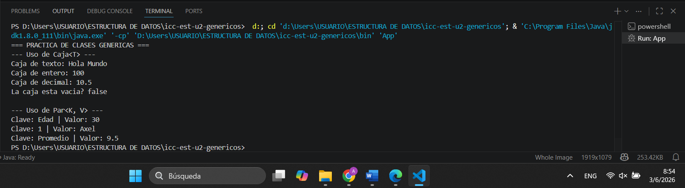
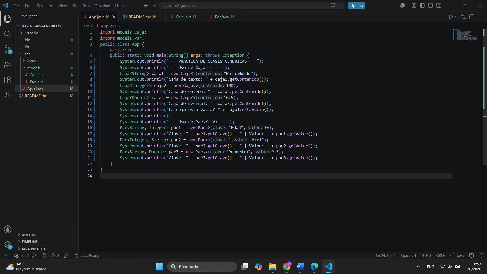

# Práctica: Clases Genéricas en Java

## Datos del Estudiante
- **Nombre:** Axel Andre Gonzalez Ramirez
- **Curso:** Grupo 1
- **Fecha:** 03/06/2026

---

## 1. Implementación de Caja<T> y Par<K, V>

**Fecha:** 03/06/2026

**Descripción:** Se implementaron las clases genericas Caja<T> y Par<K, V> en el paquete models. La clase Caja<T> permite guardar un dato de cualquier tipo, y Par<K, V> guarda una clave junto a su valor. En la imagen se puede ver como se ejecuto el programa usando diferentes tipos de datos.

